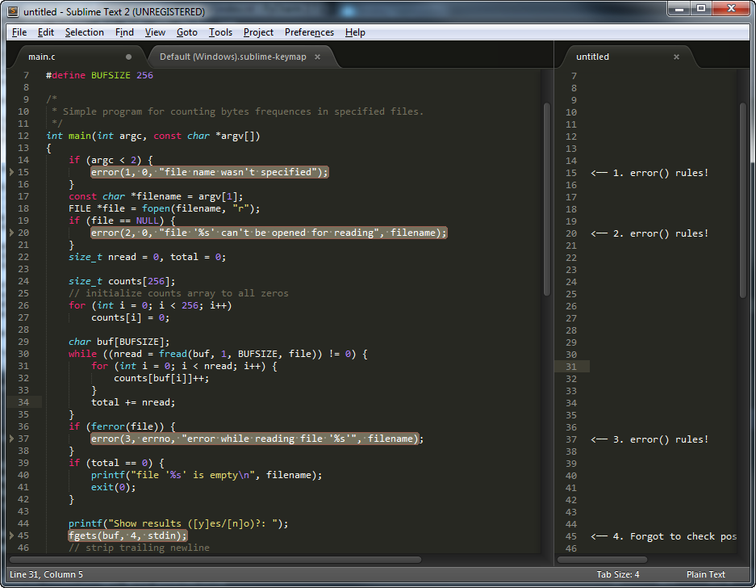

.. SublimeHints documentation master file, created by
   sphinx-quickstart on Thu Apr 11 00:17:04 2013.
   You can adapt this file completely to your liking, but it should at least
   contain the root `toctree` directive.

Добро пожаловать
================

.. toctree::
   :maxdepth: 2

Содержание
==========

* :ref:`genindex`
* :ref:`modindex`
* :ref:`search`

Для чего это?
=============

SublimeHints - плагин для редактора `Sublime Text 2`_, предназначенный для создания
и отображения пользовательских "хинтов". Можно провести аналогию с комментариями
к исходным кодам, которые можно оставлять на публичных хостингах вроде `bitbucket`_ или
`github`_, а также режимом рецензирования в Microsoft Word.

Идея проста - в специальном файле, имеющем то же имя, что и целевой файл, но
завершающемся на ``.hints`` в формате JSON описываются хинты. При открытии
целевого файла в Sublime Text у пользователя появляется возможность отобразить
хинты и при необходимости их отредактировать.

Предполгаемый сценарий использования такой: вы просматриватете исходные тексты
некой чужой программы или, скажем, отчета в LaTeX, попутно комментируя вызвавшие
интерес фрагменты при помощи плагина. Закончив, вы отправляете автору файл с хинтами,
использовав который, тот может быстро оценить ваши замечания.

Варианты отображения
--------------------

В настоящий момент рассматривается несколько возможных вариантов визуализации
хинтов, в частоности исключительно текстовый, в котором хинты отображаются
средствами самого редактора, а также браузерный. В последнем случае при открытии
хинтов генерируется временный файл с разметкой, содержащей оригинальный файл и
хинты к нему.

Текущая версия отображения в самом редакторе выглядит как-то так:

А в случае с браузером так:

.. image:: in-browser-view.png
    :align: center

Формат хинтов
-------------

В данный момент формат файла хинтов такой:

.. code-block:: json

    {
        "created": "2013-02-18:00:00:00",
        "author": "east825",
        "hints": [
            {
                "text": "Ham! Spam! Spam! Spam! Eggs! Sausages!",
                "places": [[0, 0, 0, 10], [10, 2, 20, 42]]
            },
            {
                "places": [[3, 12, 3, 80]],
                "text": "Dead parrot"
            },
            {
                "places": [[3, 12, 3, 80], [4, 12, 7, 80]],
                "text": "Foo bar baz quux"
            }
        ]
    }

Рассмотрим назначение отдельных полей:

created
    Время создания файла хинтов. Строка в формате стандарта ISO8601, т.е. ``%Y-%m-%d:%H:%M:%S``.

author
    Автор хинтов одной строкой.

hints
    JSON массив из объектов содержащих следующие поля.

text
    Содержимое файла хинта одной строкой.

places
    Один хинт может относится к нескольким фрагментам текста, что естественно
    вписывается в возможность работы с несколькими курсорами и создания нескольких
    выделений текста в самом редакторе, поэтому в этом поле хранится массив из
    диапазонов (или в терминах API Sublime Text *регионов*). Каждый такой регион
    описывается массивом вида ``[строка1 колонка1 строка2 колонка2]``.

.. _Sublime Text 2: http://www.sublimetext.com/2
.. _bitbucket: http://bitbucket.org/
.. _github: http://github.com/
